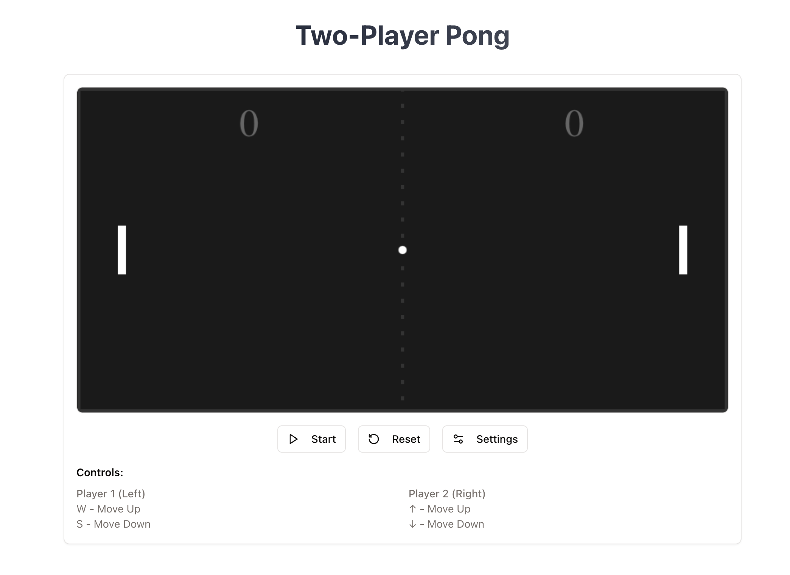

# Two-Player Pong

A simple, classic Pong game for two players. This project is built using HTML, CSS, and JavaScript. Both players control their paddles with different keys, aiming to bounce the ball past the opponent’s paddle.

You can play the game at : https://react-pong-duel-ksaideekshith.replit.app/



## Table of Contents

1. [Overview](#overview)
2. [Features](#features)
3. [Gameplay](#gameplay)
4. [Controls](#controls)
5. [Installation and Setup](#installation-and-setup)
6. [Contributing](#contributing)
7. [License](#license)

## Overview

This Two-Player Pong game is a straightforward recreation of the classic Pong arcade game. Each player maneuvers a vertical paddle, trying to ensure the ball does not pass them. The first player to score a set number of points wins.

## Features

- **Two-player support:** No AI involved—two humans can play against each other on the same keyboard.
- **Keyboard controls:** Use different sets of keys for each player.
- **Score tracking:** Each player’s score is displayed at the top of the screen.
- **Start, Reset, and Settings buttons:**
  - **Start:** Begin or pause the game.
  - **Reset:** Reset the scores and ball position.
  - **Settings:** Potentially adjust game speed, paddle size, or other parameters (depending on your implementation).

## Gameplay

1. **Objective:** Prevent the ball from getting past your paddle.
2. **Scoring:** Each time a player fails to return the ball, the opponent gains one point.
3. **Winning:** The first player to reach the predetermined score (often 10 or a configurable value) wins the match.

## Controls

- **Player 1 (Left Paddle):**

  - **W**: Move Up
  - **S**: Move Down

- **Player 2 (Right Paddle):**
  - **↑ (Up Arrow)**: Move Up
  - **↓ (Down Arrow)**: Move Down

## Installation and Setup

1. **Open the project folder** in your preferred code editor or file explorer.

2. **Run the game:**
   - Simply open `index.html` in your web browser.
   - Alternatively, you can serve it with a local web server (e.g., using Live Server in VSCode).
   - **Start playing!** Press the **Start** button to begin the game.

## Screenshots

Here are a couple more images demonstrating the user interface and gameplay:

- **Main Interface**

## Contributing

1. **Fork** the repository.
2. **Create** a new feature branch:
   ```bash
   git checkout -b feature/new-feature
   ```
3. **Commit your changes:**
   ```bash
   git commit -m "Add some new feature"
   ```
4. **Push to the branch:**
   ```bash
   git push origin feature/new-feature
   ```

## License

This project is licensed under the MIT License. You are free to use, modify, and distribute this software in accordance with the license terms.

Enjoy playing Two-Player Pong! If you have any questions or suggestions, feel free to open an issue or submit a pull request. Have fun!
